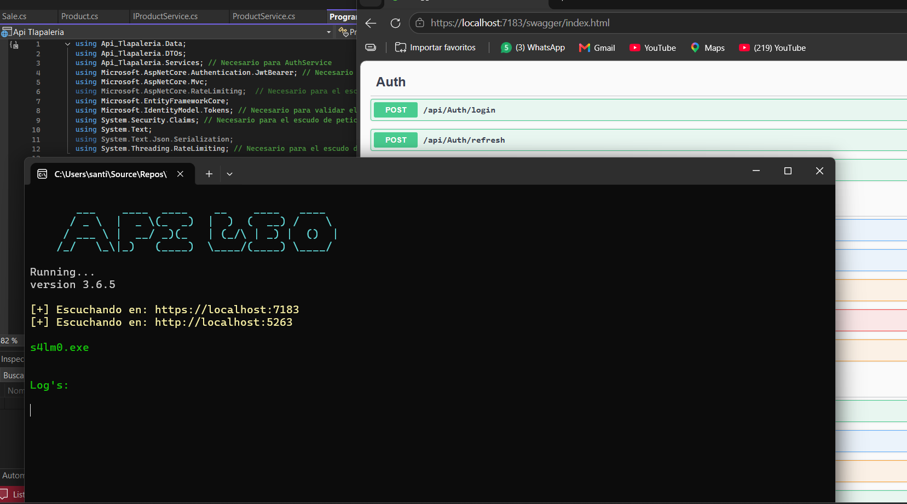

<div align="center">

```text
  ___    ____  ____    __    ____   ____
  / _ \  |  _ \(_  _)  |  )  (  __) /    \
  / ___ \ |  __/ _)(_   | (_/\ | _) |  ()  |
/_/   \_\|_)   (____)  \____/(____) \____/
 by:s4lmo.exe
```

### Backend API - Sistema POS & ERP Multi-caja | `s4lm0.exe`

*Un núcleo backend robusto y de alto rendimiento diseñado para la gestión comercial avanzada, control de inventarios complejos y analítica financiera.*

</div>



---

## 🚀 Sobre el Proyecto

Este backend está desarrollado en **C# y ASP.NET Core**, optimizado para operar como el motor central de un **Sistema ERP y POS multi-caja**. Está diseñado para resolver problemáticas comerciales del mundo real —como la gestión flexible de unidades y presentaciones sin duplicar registros de inventario— garantizando seguridad, trazabilidad de precios y control financiero en tiempo real.

*Creado desde la experienza de 6 años de trabajo en una Tlapaleria*

---

## 🛠️ Tecnologías y Stack

* **Framework:** .NET / ASP.NET Core
* **Acceso a Datos:** LINQ, Entity Framework Core / SQL
* **Seguridad:** Hashing de contraseñas con **BCrypt** y autenticación basada en roles (RBAC)
* **Sesiones:** Multi secciones por usuario, los administradores pueden otorgar o quitar el acesso a usuarios incluso con sesiones activas
* **Control de Versiones:** Git / GitHub

---

## ✨ Características Principales

### 🛒 1. POS Multi-caja y Operaciones de Venta
* Gestión simultánea de múltiples cajas registradoras y turnos de cajero.
* Procesamiento rápido de transacciones y cálculo de cambio.

### 📦 2. ERP e Inventario Inteligente Avanzado
* **Manejo de Presentaciones Múltiples:** Permite vender un producto en diferentes formatos (ej. *Bulto de cemento de 50 kg* o *Cemento por 1 kg*) **sin necesidad de duplicar el producto ni alterar la integridad del stock base**.
* Control riguroso de **fechas de caducidad** para evitar mermas por productos vencidos con alerta por fecha de caduccidad proxima.
* Sugerencias inteligentes de nombres y autocompletado optimizadas para búsqueda rápida en mostrador.

### 📈 3. Historial de Precios y Trazabilidad
* Registro histórico de cambios de precios por producto(precio proveedor y publico).
* Métricas y gráficos de evolución: visualiza exactamente cuánto ha subido o cambiado el costo y precio de venta de un artículo a lo largo del tiempo.

### 💰 4. Módulo Financiero y Analítica
* Cálculo automático de **ventas netas** y **ganancias reales**.
* Reportes de rendimiento financiero orientados a la toma de decisiones comerciales.
* Reportes por rango de fechas
* Registro de Egresos: Pago de servicios, Pago a proveedores 

### 🚚 5. Gestión de Pedidos y Cadena de Suministro
* Control completo del ciclo de compra: creación de pedidos a proveedores, seguimiento y recepción de mercancía en almacén para actualización automática de stock.

### 👥 6. Control de Acceso Basado en Roles (RBAC)
* Seguridad granular por roles de usuario (Administrador, Cajero, Almacenista, etc.).
* Encriptación robusta de credenciales con **BCrypt**.
* **Adinistradores:** Los administradores pueden controlar los acesos de los usuarios, reestablecer contraseñas

---

## 🚀 Inicio Rápido y Ejecución

Al iniciar el servicio, el sistema inicializa los componentes principales mostrando la interfaz de consola:

```csharp
// --- PANTALLA DE CARGA ---
Console.WriteLine(@"
   ___    ____  ____    __    ____    ____ 
  / _ \  |  _ \(_  _)  |  )   (  )   /    \
 / ___ \ |  __/ _)(_   | (_/\ | _) |  ()  |
/_/   \_\|_|   (____)  \____/(____) \____/  
");
Console.WriteLine("ejecutando...");
Console.WriteLine("versión 3.6.5 \n");
Console.WriteLine("s4lm0.exe\n");
// -------------------------
```

### Prerrequisitos
* .NET SDK 8
* MySQL configurado

## 🛡️ Seguridad
* Las contraseñas de los usuarios nunca se almacenan en texto plano; se utiliza **BCrypt** para un hashing seguro.
* Endpoints protegidos mediante políticas de autorización basadas en claims y roles.

---

<div align="center">
  <sub>Desarrollado con arquitectura limpia y optimizado para entornos comerciales de alta exigencia.</sub>
</div>
